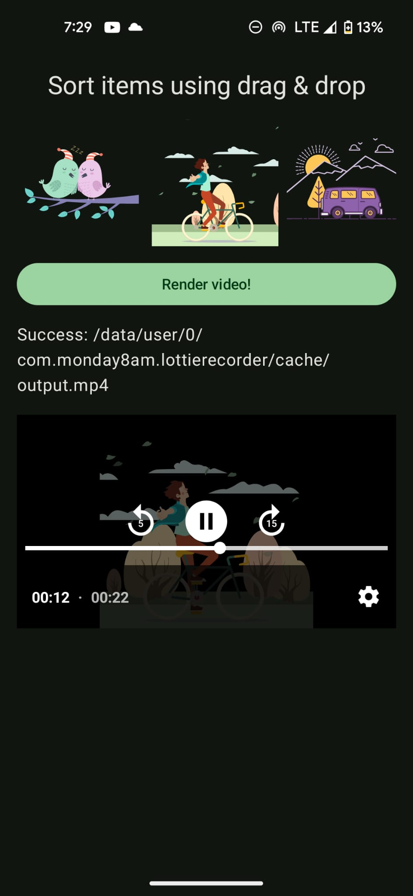

# 🎬 Export Lottie + Audio to Video on Android

This example project demonstrates how to export a **Lottie animation + audio track** into a video file using [Android's Media3 Transformer](https://developer.android.com/media/transform) and hardware-accelerated rendering techniques.

> Based on the blog post:  
> 📖 [Exporting Lottie and Audio to Video on Android (2025)](https://monday8am.com/blog/2025/08/21/exporting-lottie-and-audio-to-video.html)

## ✨ Features

- Render any Lottie animation to video using GPU acceleration.
- Overlay an audio track (MP3) onto the animation timeline.
- Frame-accurate sync between animation and audio.
- Works on most Android devices, including low-end hardware.

## 📦 Tech Stack

- **Media3 Transformer + RawAssetLoader** — for reading video and audio chunks and encoding the final video.
- **Lottie for Android** — for rendering vector animations.
- **Hardware Canvas + SurfaceTexture + OpenGL** — for near-zero-copy bitmap rendering.
- **ImageReader** as a bridge between OpenGL textures and HardwareCanvas drawing surface.

## 📸 Screenshot



## 🧱 How It Works

1. A `SurfaceAssetLoader` from Media3 `Transformer` provides a way to pass video and audio content, but requires frames as OpenGL textures and raw audio data via a custom RawAssetLoader.
2. A `LottieDrawable` can be rendered frame-by-frame into a hardaware acelerated `Canvas` backed by a `SurfaceTexture`.
3. To bridge them, we use `ImageReader`, which provides a Surface that supports GPU‑accelerated frame capture.
4. Final code looks like:

```kotlin
launch {
  repeat(totalLottieFrames) { frameIndex ->
    // 1. Draw Lottie frame → GPU‑canvas
    // 2. Acquire and upload image → texture
    // 3. Queue texture to Media3
  }
  rawAssetLoader.signalEndOfVideoInput()
}

launch {
  while (!endOfStream) {
    // 1. Decode next audio chunk
    // 2. Queue to Media3
  }
  rawAssetLoader.signalEndOfAudioInput()
}
```
